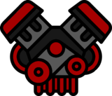

# **[Mini-car racing](https://mini-car-racing.netlify.app)**

It is an online game designed for entertainment.

## Its characteristics are:

- flexibility that allows everyone to play the game on a computer or mobile phone. In addition, there are 3 types of handling for such devices;
- somehow made car physics with speed, "revolutions per minute (RPM)" and gears;
- a simple story divided into 4 parts. In INTRO, the player completes a tutorial, while in RACES he competes against bots;
- 3D random "turns" that won't make you die of boredom in the first few minutes;
- real CREDITS with developers and others listed in it;
- possibility to contact me by e-mail with the service "Formspree";
- a large number of songs that you can listen to by simply turning it on;
- menu with many functions and EVEN PRANKS (no spoilers);

## technologies/languages:

- HTML;
- CSS / SCSS;
- Javascript / Typescript;
- Jquery, Jquery-cookie;
- AOS (animate on scroll library);
- Formspree;
